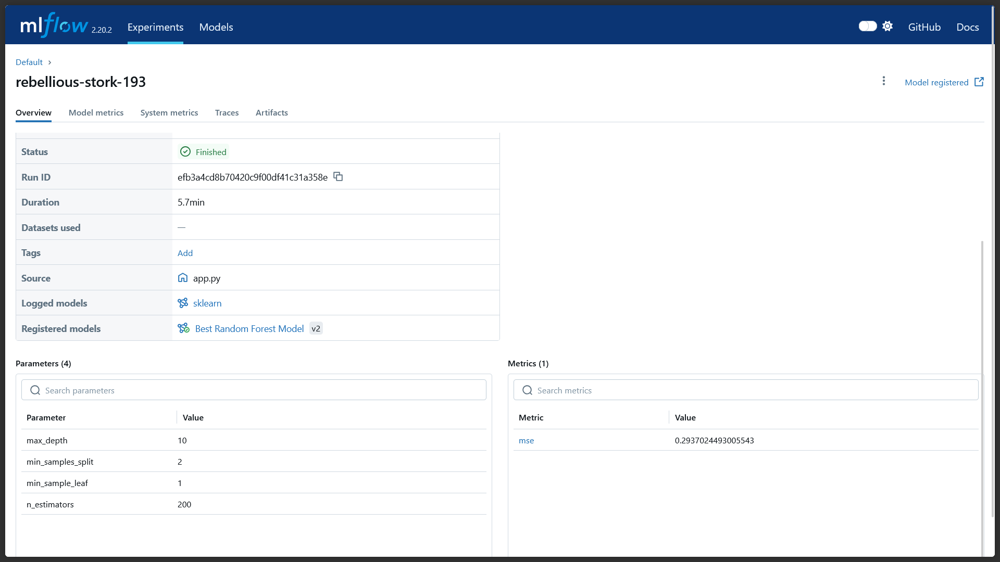

# California Housing Price Prediction with MLflow & Random Forest

This project trains a **Random Forest Regressor** model on the California Housing dataset and performs **hyperparameter tuning** using `GridSearchCV`. The best model and its metrics are logged using **MLflow**.



---

## 🧠 Problem Statement

Predict housing prices in California using features such as:
- Average number of rooms
- Population
- Median income
- And more...

---

## 📦 Dependencies

- `pandas`
- `numpy`
- `scikit-learn`
- `mlflow`

Install them with:

```bash
pip install pandas numpy scikit-learn mlflow
```

---

## 🧰 Features

- Loads **California housing dataset**
- Performs **data preprocessing**
- **Splits** data into training and test sets
- Uses **GridSearchCV** for hyperparameter tuning
- Logs **best model**, **parameters**, and **metrics** to MLflow
- Infers the **model signature** for reproducibility

---

## 🔍 Hyperparameters Tuned

```python
param_grid = {
   "n_estimators": [100, 200],
   "max_depth": [5, 10], 
   "max_features": [0.5, 0.9],
   "min_samples_split": [2, 5],   
   "min_samples_leaf": [1, 2] 
}
```

---

## 📊 Metrics Logged

- Mean Squared Error (MSE)
- Best hyperparameters

---

## 🚀 Run the Project

1. Start the MLflow UI in a separate terminal:
```bash
mlflow ui
```

2. Run the training script:
```bash
python train.py
```

3. Open your browser and navigate to:
```
http://127.0.0.1:5000
```

---

## 🧪 Output Example

Once training is complete, the best model is automatically logged in MLflow. You can view:

- The model artifact
- Parameters and metrics
- Comparison across multiple runs

---

## 📁 File Structure

```plaintext
.
├── train.py               # Main training script
├── README.md              # This file
```

---

## ✅ Author

**Chris Aaron Rodrigues**  
🔗 [GitHub](https://github.com/Aaron2Rodrigues)

---

## 📄 License

This project is licensed under the MIT License.
